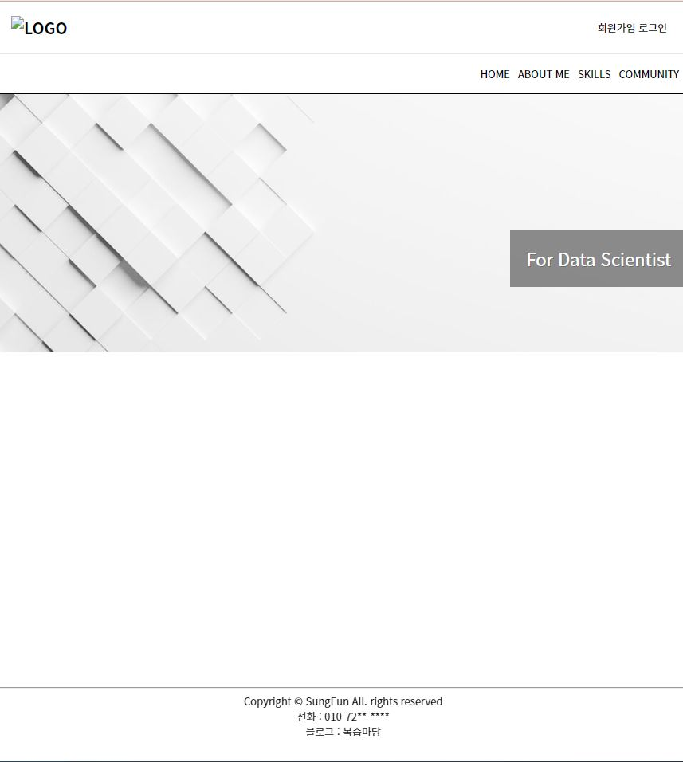
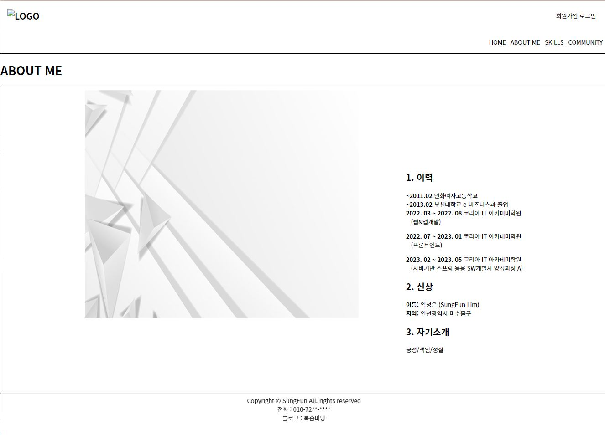
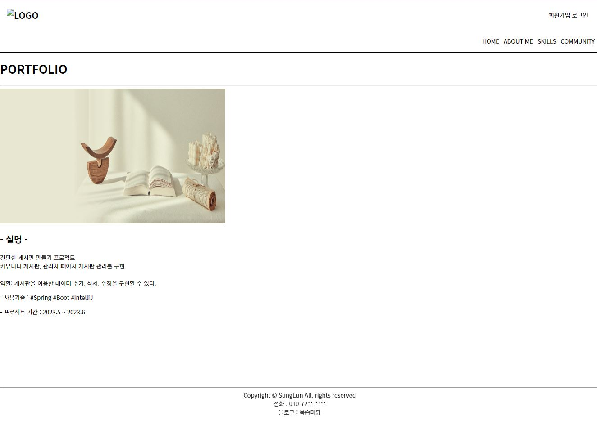
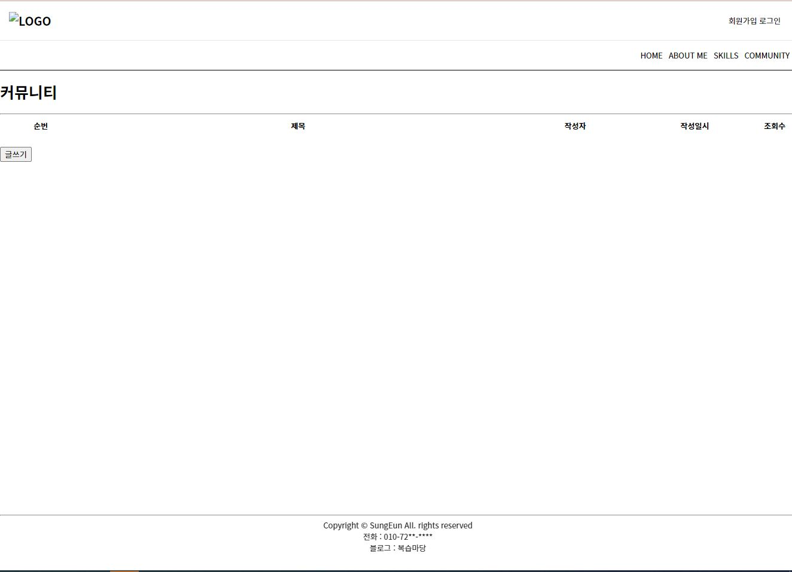

# 게시판 프로젝트

## 사용언어
- HTML / CSS / Java / JavaSpring / Spring Boot / JPA

## 개발환경
- Intelli J / dbeaver / Oralce

## 프로젝트 목표
1. 메인 페이지
2. 회원가입, 로그인 구현(타임리프 설정)
3. 관리자 페이지
4. 게시글 작성, 조회, 삭제 기능 구현

* * * 

* * *

